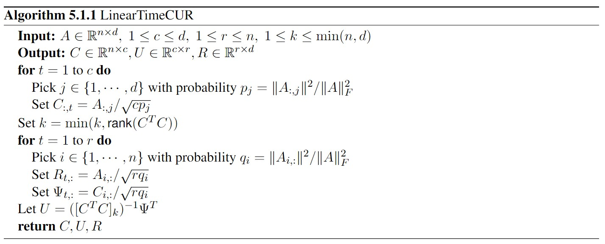
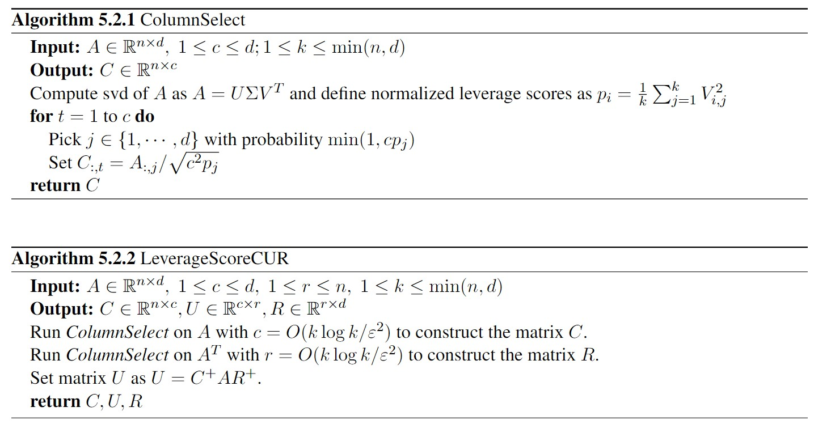

# VGG deep neural network compression

Studying of SVD and CUR factorization methods for compression of VGG models and their comparison with the original deep neural networks of VGG in image classification problems

## Network architecture

The VGG-11 architecture is used in this work

## Datasets

The evaluation is performed on standard data sets for the task of classifying images according to the accuracy metric

MNIST (train 60 000 / test 10 000)

CIFAR-10 (train 50 000 / test 10 00)

## SVD decomposition

Given the weight matrix $A \in R^{m \times n}$, there are two orthogonal matrices $U = [u_1 u_2 . . . u_m] \in R^{m \times m}$ and
$V = [v_1 v_2 . . . v_n] \in R^{n \times n}$ that will satisfy
$U^T AV = diag(σ_1, σ_2, σ_3, . . . , σ_p)$.

Denote $S = U^T AV (S \in R^{n\times n}),\ p = min(m, n)$,  and $σ_1 ≥ σ_2 ≥ σ_3 ≥ · · · ≥ σ_p$. Hence, we have:
$A = U SV^T$.

By keeping only $k$ largest singular values , we relax $A$ by:
$\widetilde A = \widetilde U \widetilde S \widetilde V:T$
where $\widetilde A \in R^{m \times n}$, $\widetilde U \in R^{m \times k}$, $\widetilde S \in R^{k \times k}$, and $\widetilde V \in R^{n \times k}$.

The weight matrix $A ∈ R^{m \times n}$ contains a total of m*n weight parameters. By utilizing the truncated SVD decomposition method, we can obtain two dense layers, $B$ and $C$, that fulfill the equation $A = B * C$ where $B = \widetilde U \in R^{m \times k}$ and $C = \widetilde S \widetilde V^T \in R^{k \times n}$.

The total number of parameters in  $B$ and
$C$ is $k ∗ (m + n)$. The compression rate of this truncated
SVD decomposition  is $$CR = \frac{mn}
{mk + nk}$$

*In our work, we used a QR-based algorithm for SVD decomposition*

## CUR decomposition

CUR techniques decompose the input weight matrix $A \in R^{n \times d}$ as a set of three matrices $C \in R^{n \times c}$, $U \in R^{c \times d}$ and $R \in R^{r \times d}$ that closely approximate $A$. The CUR matrix approximation is not unique and there are multiple algorithms for computing one (LinearTimeCUR, LeverageScoreCUR).

The weight matrix $A ∈ R^{m \times n}$ contains a total of m*n weight parameters. By utilizing the CUR decomposition technique, we will have two dense layers, $D$ and $E$, that fulfill the equation $A = D * E$ where $D = C \in R^{m \times c}$ and $E =  U * R \in R^{c \times n}$.

The total number of parameters in  $D$ and
$E$ is $c ∗ (m + n)$. The compression rate of CUR decomposition  is $$CR = \frac{mn}
{mc + nc}$$

*In our work, we used a LinearTimeCUR-based algorithm for CUR decomposition*

### LinearTimeCUR (LTCUR) [3] ###

### LeverageScoreCUR (LSCUR) [4] ###

### 

## References

[1] Mai, An, et al. "VGG deep neural network compression via SVD and CUR decomposition techniques." 2020 7th NAFOSTED Conference on Information and Computer Science (NICS). IEEE, 2020.

[2] Hamm, Keaton, and Longxiu Huang. "Cur decompositions, approximations, and perturbations." (2019).

[3] Petros Drineas, Ravi Kannan, and Michael W Mahoney. Fast monte carlo algorithms for matrices iii:
Computing a compressed approximate matrix decomposition. SIAM Journal on Computing, 36(1):184–206,
2006.

[4] Michael W Mahoney and Petros Drineas. Cur matrix decompositions for improved data analysis. Pro-
ceedings of the National Academy of Sciences, 106(3):697–702, 2009
